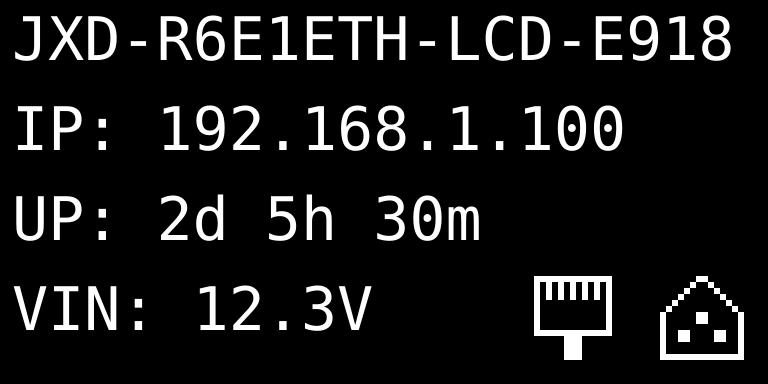
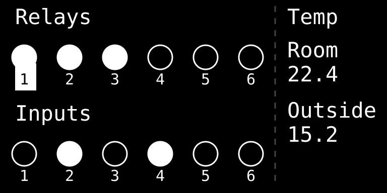

# ESPHome Device Configurations made by JetHome


This repository contains ESPHome configurations for various automation devices. These are **open-source firmware configurations** that you can customize and build yourself.

## Supported Devices

### JXD-R6-E1ETH-LCD

JetHome DIN-rail automation controller with display. For a proprietary firmware version with additional features and support, visit [JetHome official website](https://jethome.com/).

**Configurations**:

- `jxd-r6-e1eth-lcd-eth.yaml` - Ethernet variant
- `jxd-r6-e1eth-lcd-wifi.yaml` - WiFi variant

## JXD-R6-E1ETH-LCD Features

The JXD-R6-E1ETH-LCD is a powerful DIN-rail automation controller with the following capabilities:

### Hardware

- **ESP32** microcontroller with 16MB flash and PSRAM
- **6 Relay outputs** via PCA9554 I/O expander
- **6 Digital inputs** via PCA9554 I/O expander
- **OLED Display**: SSD1306/SH1106 128x64 pixels with interactive menu
- **RTC**: PCF8563 hardware real-time clock with battery backup
- **Temperature monitoring**: Onboard TMP102 sensor + Dallas DS18B20 over a DS2484 I²C-to-1-Wire bridge
- **Connectivity**: LAN8720 Ethernet or WiFi (ESP32 built-in)
- **Voltage monitoring**: Input voltage measurement
- **RS485/Modbus**: 2x UART interfaces for Modbus RTU communication

### Software Features

- **RTC Time Synchronization**: Hardware RTC with NTP sync and battery backup
- **Modbus RTU Server**: Acts as Modbus slave, mapping relays to coils and digital inputs to discrete inputs
- **Home Assistant Integration**: Native ESPHome API with automatic entity discovery and OTA updates
- **Display Control**: Interactive OLED menu with status, time, relay control, input monitoring, and settings
- **Dallas Temperature Sensors**: OneWire support for multiple DS18B20 sensors ([setup guide](doc/ONEWIRE_WORKFLOW.md))

## Repository Layout

Device configurations live in the repository root (`jxd-r6-e1eth-lcd-eth.yaml`,
`jxd-r6-e1eth-lcd-wifi.yaml`) and are thin: they set substitutions and list the packages
that make up the device. Everything else lives under `packages/`, split by role:

| Directory            | Contents                                                                                                                                                                                                               |
| -------------------- | ------------------------------------------------------------------------------------------------------------------------------------------------------------------------------------------------------------------- |
| `packages/boards/`   | Platform and the chips sitting on each board — `jxd-cpu-e1eth.yaml` (ESP32, api/ota/logger/web_server, TMP102, LED, FN button) and `jxd-d6-r6-rev1.2.yaml` (PCA9554 expander, 6 relays, 6 inputs, DS2484 1-Wire bridge) |
| `packages/features/` | SoC buses (`i2c.yaml`, `uarts.yaml`) and functionality — `temperature`, `rtc-time`, `vin-measure`, `modbus-server`, `display-off`, `ethernet`, `wifi`                                                                   |
| `packages/display/`  | Display, pages, menu and buttons — `display.yaml`, `menu.yaml`, `buttons.yaml`, `menu-items-eth.yaml`, `menu-items-wifi.yaml`                                                                                           |

The BDF display fonts in `fonts/` come from [IT-Studio-Rech/bdf-fonts](https://github.com/IT-Studio-Rech/bdf-fonts).

### Generated configs (`dist/`)

`dist/` is what the ESPHome Builder add-on imports; build and flash locally from the
device configs in the repository root. Nothing here is edited by hand — regenerate and
commit it after changing anything a device config pulls in:

```bash
python scripts/build-dist.py           # regenerate
python scripts/build-dist.py --check   # fail if stale (pre-commit and CI run this)
```

`!secret` references are carried into `dist/` rather than resolved, so nothing leaks —
but importing the WiFi variant means supplying `wifi_ap_ssid` and `wifi_ap_password`
in Home Assistant's own `secrets.yaml`.

## Quick Start

### Requirements

- **Python 3.12, 3.13 or 3.14** (ESPHome 2026.8.2 requires `>=3.12,<3.15`)
- **ESPHome 2026.8.2** (pinned version for compatibility)
- USB cable or serial adapter for initial flashing
- Network connection for OTA updates

### Installation

1. **Clone this repository**:

   ```bash
   git clone <repository-url>
   cd esphome-device-configs
   ```

2. **Set up the Python environment.** Linux/macOS:

   ```bash
   ./scripts/setup.sh
   source .venv/bin/activate
   ```

   Windows:

   ```cmd
   scripts\setup.bat
   .venv\Scripts\activate
   ```

3. **Create your secrets file**:

   ```bash
   cp secrets.yaml.example secrets.yaml
   ```

`secrets.yaml` is gitignored and never leaves your machine; `secrets.yaml.example`
is the tracked template listing every key the configs expect. Only the WiFi variant
reads secrets — it needs the fallback access point's SSID and password. A missing
file stops the build at `Error reading file secrets.yaml: [Errno 2] No such file or
directory`; a file that is present but missing a key, at `Secret 'wifi_ap_ssid' not
defined`. The Ethernet variant builds without a `secrets.yaml` at all.

### Configuration Variants

The repository provides two configuration variants:

#### Ethernet Version

```bash
esphome run jxd-r6-e1eth-lcd-eth.yaml
```

- Uses LAN8720 Ethernet controller
- Static or DHCP IP configuration
- Best for industrial/stable installations

#### WiFi Version

```bash
esphome run jxd-r6-e1eth-lcd-wifi.yaml
```

- Uses ESP32 built-in WiFi
- Captive portal for easy setup
- WiFi credentials stored in device
- Access Point mode for configuration

### Timezone

The timezone is compiled into the firmware and is never changed at runtime — Home
Assistant does not override it.

By default the build uses the timezone of the machine doing the build, so pin it
explicitly for reproducible builds:

```bash
esphome -s timezone UTC run jxd-r6-e1eth-lcd-eth.yaml
```

or per device in the device config:

```yaml
substitutions:
  timezone: Europe/Berlin
```

Both IANA names (`Europe/Berlin`) and POSIX TZ strings (`CET-1CEST,M3.5.0,M10.5.0/3`)
are accepted. POSIX strings per zone: [posix_tz_db](https://github.com/nayarsystems/posix_tz_db/blob/master/zones.csv).

### First Flash

For the first flash, connect via USB:

```bash
esphome run jxd-r6-e1eth-lcd-eth.yaml
# or
esphome run jxd-r6-e1eth-lcd-wifi.yaml
```

Subsequent updates can be done over-the-air (OTA):

```bash
esphome run jxd-r6-e1eth-lcd-eth.yaml --device <IP_ADDRESS>
```

### WiFi Setup (WiFi version only)

The WiFi variant ships without network credentials: it raises a fallback access point and
is provisioned through its captive portal. See [WiFi Setup](doc/WIFI_SETUP.md).

## Display UI Overview

Four pages plus a menu. The main page is what you get at boot and after HOME; everything
else is one button away from it.

### Main Page



Shows device name, uptime, input voltage, and IP address.

**Getting here**: HOME from anywhere, or BACK from another page.

### Status Page



Relay states, digital input states and temperature readings at a glance, and it switches
the relays: LEFT and RIGHT move the selection along the relay row — the selected number is
drawn inverted on the device — and CENTER toggles that relay.

**Getting here**: LEFT from the main page.

### Time Page


Current date and time from the hardware RTC.

**Getting here**: RIGHT from the main page.

### Menu


- **Relays** - toggle each of the 6 relays
- **Inputs** - live state of the 6 digital inputs
- **Temperatures** - temperature sensor readings
- **Info** - network information (IP, MAC address)
- **Settings** - display auto-off timer, WiFi credential reset (WiFi version only), factory reset, reboot

**Getting here**: CENTER from the main page.

### Blank Screen

The display blanks after the inactivity timeout (**Settings → Display off**: 5, 10 or 15
minutes, or never). Any button wakes it — LEFT lands on the status page, RIGHT on the time
page, anything else on the main page.

**Getting here**: BACK from the main page, or wait out the timer.

### Buttons

| Button      | Effect                                                                                    |
| ----------- | ----------------------------------------------------------------------------------------- |
| `HOME`      | Main page, from anywhere                                                                  |
| `BACK`      | Main page; from the main page blanks the screen; in the menu goes up one level, then exits |
| `LEFT`      | Main page → status page; on the status page selects the previous relay; adjusts menu values |
| `RIGHT`     | Main page → time page; on the status page selects the next relay; adjusts menu values      |
| `CENTER`    | Main page → menu; on the status page toggles the selected relay; in the menu enters        |
| `UP` `DOWN` | Move through the menu                                                                      |

## Documentation

- **[OneWire Workflow Guide](doc/ONEWIRE_WORKFLOW.md)**: Step-by-step guide for adding Dallas DS18B20 temperature sensors
- **[WiFi Setup](doc/WIFI_SETUP.md)**: Provisioning the WiFi variant through its captive portal

## Modbus RTU Server

The device can act as a Modbus RTU server (slave) for integration with PLCs, SCADA systems, and other industrial automation equipment:

- **Slave Address**: 0x01 (configurable)
- **Baud Rate**: Configurable via UART settings (`packages/features/uarts.yaml`, `jxm_uart2`)
- **Coils** `0x0000`-`0x0005` (FC 0x01/0x05/0x0F): read/write relay 1-6
- **Discrete Inputs** `0x0010`-`0x0015` (FC 0x02): read digital input 1-6
- **Holding/input registers**: none mapped; a courtesy response answers `0` instead of an exception

Upstream `modbus_server` keeps coils and discrete inputs in a single bit address space, so
the two blocks are placed at different offsets rather than both starting at zero.

**RS-485 Connector (JXM2)**:

- Pin 1: B
- Pin 2: A
- Pin 3: B
- Pin 4: A

The map is defined in `packages/features/modbus-server.yaml`. `scripts/modbus_probe.py` walks the
whole map over RS485 for a quick check:

```bash
.venv/bin/python scripts/modbus_probe.py --port /dev/ttyUSB2 probe
```

## Contributing

Contributions are welcome! Please feel free to submit issues or pull requests.

## License

This project is open-source.

## Related Links

- [ESPHome Official Documentation](https://esphome.io/)
- [JetHome Official Website](https://jethome.com/) - Proprietary firmware version with additional features
- [JetHome AliExpress Store](https://aliexpress.ru/store/1105052969)

## Support

For issues related to:

- **Open-source firmware**: Use GitHub issues in this repository
- **Hardware or proprietary firmware**: Contact [JetHome support](mailto:sales@jethome.com)
